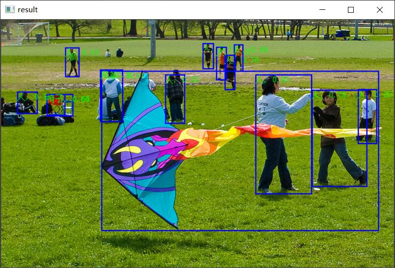
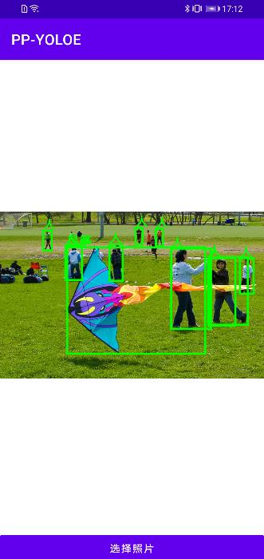

# PP-YOLOE

本项目是基于[PaddleDetection](https://github.com/PaddlePaddle/PaddleDetection)实现的PP-YOLOE，PP-YOLOE是单阶段Anchor-free模型，其精度(COCO数据集mAP)和推理速度均优于YOLOv5模型，PP-YOLOE在COCO test-dev2017数据集上精度达到49.0%，在单卡V100上FP32推理速度为123.4FPS, V100上开启TensorRT下FP16推理速度为208.3FPS。其中还包含了X/L/M/S四种模型类型，适合部署在多种多样的硬件上，在手机上部署，推理速度也是极快的。

# 模型表
这个表是官方的测试表格。

| 模型类型 | Epoch | 输入尺寸 | Box AP<sup>val<br>0.5:0.95 | Box AP<sup>test<br>0.5:0.95 | Params(M) | FLOPs(G) | V100 FP32(FPS) | V100 TensorRT FP16(FPS) |
|:----:|:-----:|:----:|:--------------------------:|:---------------------------:|:---------:|:--------:|:--------------:|:-----------------------:|
|  S   |  80   | 640  |            43.7            |            43.9             |   7.93    |  17.36   |     208.3      |          333.3          |
|  M   |  80   | 640  |            49.8            |            50.0             |   23.43   |  49.91   |     123.4      |          208.3          |
|  L   |  80   | 640  |           52.9	            |            53.3             |   52.20   |  110.07  |      78.1      |          149.2          | 
|  X   |  80   | 640  |           54.7	            |            54.9             |   98.42   |  206.59  |      45.0      |          95.2           | 


## 安装环境

 - 首先安装的是PaddlePaddle的GPU版本，如果已经安装过了，请跳过。
```shell
conda install paddlepaddle-gpu==2.3.2 cudatoolkit=10.2 --channel https://mirrors.tuna.tsinghua.edu.cn/anaconda/cloud/Paddle/
```

 - 安装ppvector库。
 
使用pip安装，命令如下：
```shell
python -m pip install ppyoloe -U -i https://pypi.tuna.tsinghua.edu.cn/simple
```

**建议源码安装**，源码安装能保证使用最新代码。
```shell
git clone https://github.com/yeyupiaoling/PP-YOLOE.git
cd PP-YOLOE/
python setup.py install
```

# 快速使用

通过以下方式可以快速使用本项目导出COCO训练的预测模型，使用该预测模型快速推理图片。

1. 首先导出COCO的预测模型，执行`export_model.py`时，当`--resume_model`参数为None时，会自动加载官方的COCO预训练模型，使用这个预训练模型导出预测模型。
```shell
python export_model.py --resume_model=None
```

2. 然后执行`infer.py`指定图像路径执行推理。
```shell
python infer.py --image_path=dataset/test.jpg
```

识别结果：




# 训练模型


## 准备数据

准备训练数据`train.json`和评估数据`eval.json`，本项目只支持使用COCO格式的数据集，如果你使用的是VOC格式数据集，可以使用项目自带的工具进行转换，使用方式如下。如果你的数据本身就是COCO格式的，可以直接忽略这个步骤

1. 首先生成VOC数据列表和标签列表，执行下面命令就可以生成训练数据列表`train.txt`和评估数据列表`eval.txt`，以及列表文件`label_list.txt`，它们都存放在`dataset`目录下。
```shell
python create_voc_list.py
```

2. 然后执行`voc2coco.py`即可生成COCO格式的数据集，训练数据和评估数据分别对应`train.json`和`eval.json`，同样是存放在`dataset`目录下。
```shell
python voc2coco.py
```

## 训练模型

准备好数据之后就可以开始训练了，训练程序要注意以下几个重要参数，首先是模型类型`model_type`，一共有X/L/M/S四种模型类型，其次是分类大小`num_classes`，这两个参数需要根据自己的实际情况来设置，更多参数可以查看该程序文件或者执行`python train.py -h`查看。本项目支持多卡训练，具体看下面命令。
```shell
# 单卡训练
python train.py --model_type=M --num_classes=80
# 单机多卡训练
python -m paddle.distributed.launch --gpus '0,1' train.py --model_type=M --num_classes=80
```

## 评估模型

训练结束之后，如果需要查看模型的准确率，可以执行评估程序`eval.py`，需要指定模型类型，分类大小以及模型的文件夹路径。
```shell
python eval.py --model_type=M --num_classes=80 --resume_model=output/PPYOLOE_M/best_model
```

## 导出预测模型

训练完成之后，可以导出预测模型用于之后的部署，使用及其下面命令，即可完成导出进预测模型。需要指定模型类型，分类大小以及模型的文件夹路径。`image_shape`是指定输入图片的大小，如果对性能要求比较高的话，可以尝试设置更小的图片大小，例如`3,416,416`，或者`3,320,320`，默认是`3,640,640`。
```shell
python export_model.py --model_type=M --num_classes=80 --resume_model=output/PPYOLOE_M/best_model
```

# 预测

本项目提供三种预测方式，第一种是使用PaddlePaddle自身的Inference预测接口进行预测，第二种是使用ONNX预测接口执行预测，第三种是部署在Android设备上进行预测。

## Inference

使用PaddlePaddle自身的Inference预测接口进行预测，这里提供了两种方式，第一种是使用图片的路径进行预测并显示结果，第二种是使用摄像头或者视频文件进行预测。
```shell
# 使用图片路径进行预测并显示
python infer.py --image_path=dataset/test.jpg --model_dir=output_inference/PPYOLOE_M
# 使用摄像头进行实时预测
python infer_camera.py --device_id=0 --model_dir=output_inference/PPYOLOE_M
```

识别结果：


## ONNX

使用ONNX预测接口执行预测，使用这种方式的话需要额外安装`onnxruntime`库，并且需要找出对应的模型进行下面命令可以导出ONNX模型，需要根据实际情况修改模型的路径`model_dir`。
```shell
python to_onnx_model.py
```

导出ONNX模型之后就可以使用`onnxruntime`来进行推理，命令如下，分别指定预测图片路径和ONNX模型路径。执行推理并显示结果
```shell
python infer_onnx.py --image_path=dataset/test.jpg --onnx_model=output_inference/model.onnx
```

识别结果：


## Android

如果要部署在Android上面使用的话，需要导出Paddle Lite模型，通过上面命令可以导出Paddle Lite模型。需要根据自己的实际情况修改模型的路径，以及是否需要进行量化量化，量化可以减少1/2的模型大小，但预测速度上不会有太大变化，一般不会降低模型的准确率。导出的Paddle Lite模型会保存到`output_inference/detect_model.nb`，**建议**在导出模型`export_model.py`的时候，在指定`image_shape`最好是选择`3,320,320`，这样推理速度会快一些。
```shell
python to_lite_model.py
```


**使用Android应用：**Android源码存放在本项目的根目录中的`Android`，可以直接用Android Studio打开使用，该演示应用有两个功能，第一是`打开相机识别`，第二是`打开相册识别`。如果要替换自己训练的模型，只需要操作这两个文件即可：

1. 把`Android/ai/src/main/assets/detect_model.nb`模型文件替换成你导出的`detect_model.nb`。
2. 把`Android/ai/src/main/assets/label_list.txt`标签列表文件替换成你的列表文件，这列表文件在`dataset/label_list.txt`。

打开相册识别的演示界面：




# 参考

1. https://github.com/PaddlePaddle/PaddleDetection
2. https://github.com/PaddlePaddle/Paddle-Lite